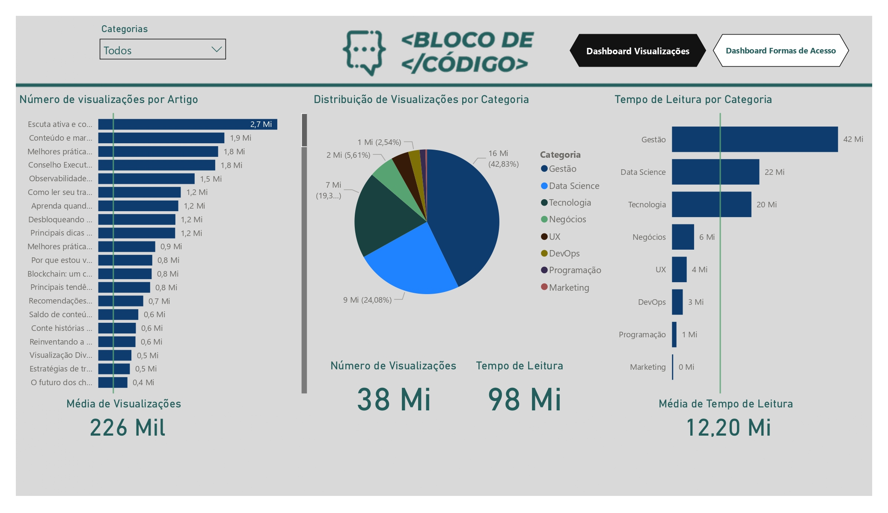
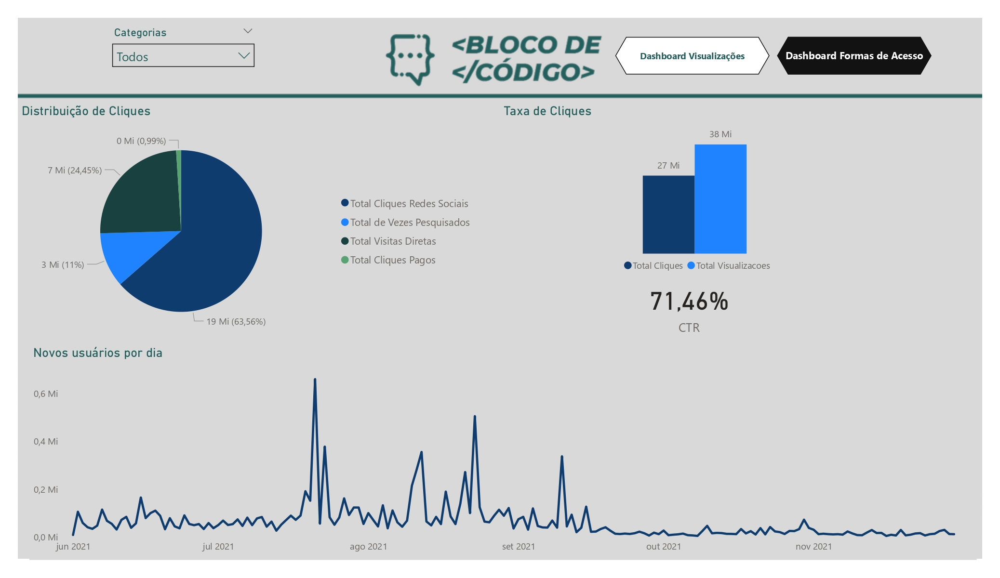
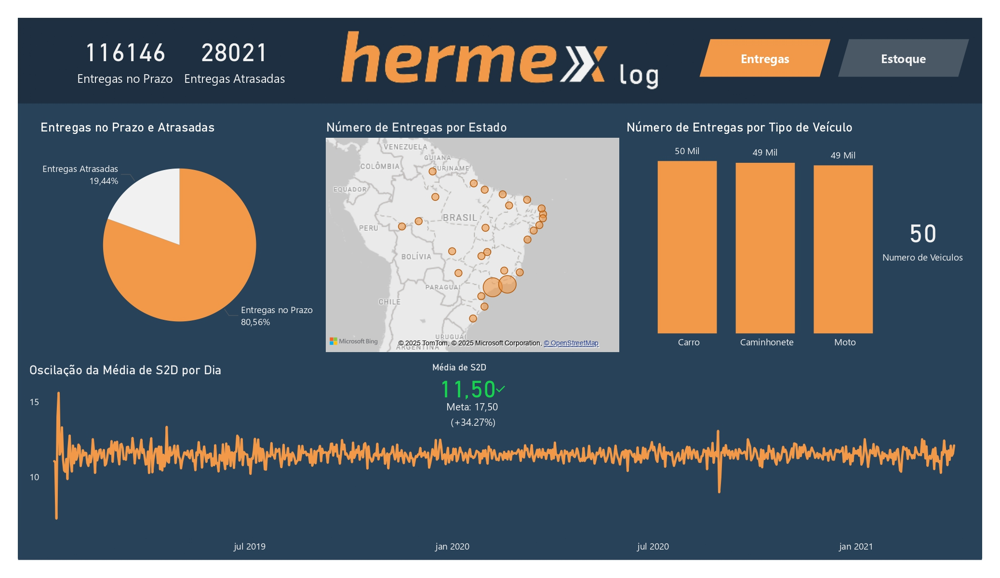
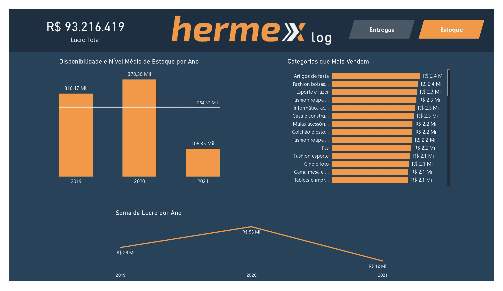
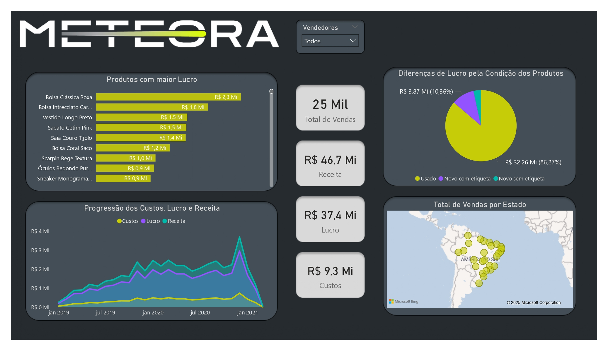

# Challenge BI 3° Edição
O projeto consiste em realizar uma análise de Business Intelligence dos processos de 3 empresas fictícias, sendo essas as empresas "Bloco de Código", "Hermex" e "Meteora".

Cada empresa atua em ramo diferente de mercado e análise consiste em analisar os dados operacionais da empresa em busca de insights que possam auxiliar a tomada de decisão ou aumentar e eficiência de seus processos operacionais. Ao mesmo, tempo organizar esses insights de um forma que seja *user friendly* através de um dashboard interativo que facilite a visualização desses insights.

## Ferramentas Utilizadas
- Power BI
- DAX
- PowerQuery
- Excel

## Habilidades Trabalhadas
- ETL
- Análise de Dados
- Modelagem de Dados
- Criação e Design de Gráficos
- Design de Dashboards

# 1° Bloco de Código
Blog que fala que tópicos de tecnologia, gestão, negócios e afins, procura obter insights sobre informações como formas de acesso ao blog, novos usuários, tempo de leitura e quais tópicos são mais visualizados e assim avaliar a eficácia da sua campanha de marketing.

# 2° Hermex
Empresa de vendas de produtos diversos, precisa de insights a respeito da eficiência da logística das entregas do seu negócio. Ela trata de informações como percentual de entregas no prazo, tempo te entrega, disponibilidade de estoque e afins.

# 3° Meteora
Empresa de vendas de roupas, busca insights a respeito da sua área de vendas. Ela trata de informações como lucro, custos, produtos que mais lucram, estados com maior rentabilidade e afins.

